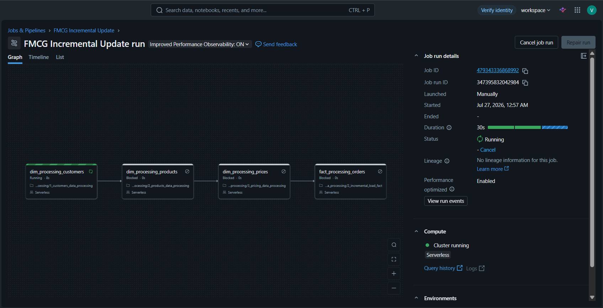
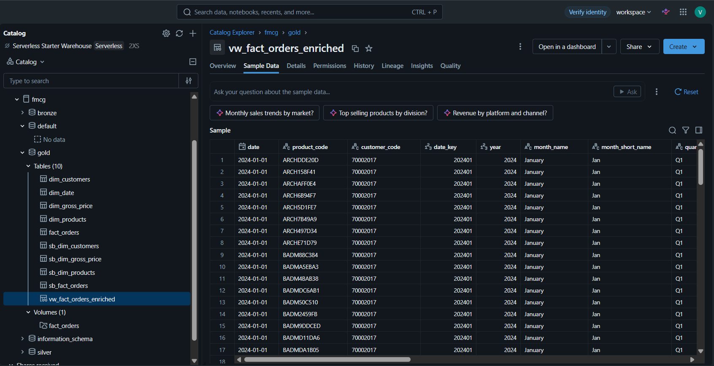
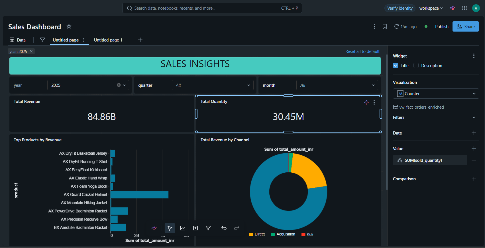

# 🚀 Enterprise Data Lakehouse Platform for M&A Data Consolidation

An end-to-end **Enterprise Data Engineering** project built using **Databricks**, **PySpark**, **Spark SQL**, **AWS S3**, **Delta Lake**, and **Unity Catalog**.

This project simulates a real-world **Mergers & Acquisitions (M&A)** scenario where a parent FMCG company (**Atlon**) acquires a startup (**Sports Bar**). The objective is to integrate heterogeneous datasets into a unified analytics platform using the **Medallion Architecture (Bronze → Silver → Gold)**.

---

# 📌 Project Overview

Enterprise acquisitions often lead to significant data integration challenges due to:

- Different database schemas
- Inconsistent naming conventions
- Duplicate records
- Missing values
- Different reporting granularities
- Data quality issues

This project addresses these challenges by building a scalable Data Lakehouse pipeline capable of processing both historical and incremental data while maintaining a unified enterprise reporting model.

---

# 🏗️ Architecture

The architecture follows the Medallion Architecture:

- **Bronze Layer**
  - Raw data ingestion from AWS S3
  - Metadata tracking
  - Audit columns

- **Silver Layer**
  - Data cleansing
  - Schema standardization
  - Missing value handling
  - Duplicate removal
  - Business rule transformations

- **Gold Layer**
  - Enterprise Star Schema
  - Parent & Child company consolidation
  - Analytics-ready datasets

---

# ⚙️ Technology Stack

| Category | Technologies |
|-----------|--------------|
| Platform | Databricks |
| Language | Python |
| Processing | PySpark |
| Query Language | Spark SQL |
| Storage | AWS S3 |
| Data Format | Delta Lake |
| Catalog | Unity Catalog |
| Workflow | Databricks Workflows |
| Analytics | Databricks Dashboards |
| AI | Databricks Genie |

---

# 🏛️ Medallion Architecture

AWS S3
     │
     ▼
 Bronze
     │
     ▼
 Silver
     │
     ▼
 Gold
     │
     ▼
 Analytics Dashboard
     │
     ▼
 Databricks Genie AI

# 📂 Repository Structure

databricks-fmcg-medallion-pipeline
│
├── datasets/
│   ├── parent/
│   └── child/
│
├── notebooks/
│   ├── setup/
│   ├── dimension_data_processing/
│   └── fact_data_processing/
│
├── screenshots/
│   ├── project_architecture.png
│   ├── orchestration_pipeline.png
│   ├── gold_table.png
│   └── sales_dashboard.png
│
├── LICENSE
└── README.md

# 🔄 Pipeline Workflow

The pipeline processes data through the following stages:

1. Raw CSV ingestion from AWS S3
2. Bronze Delta table creation
3. Data validation and cleaning
4. Schema standardization
5. Duplicate removal
6. Data transformation
7. Delta MERGE (Upsert)
8. Gold Star Schema generation
9. Dashboard creation
10. Genie AI querying

---

# 📊 Project Features

✅ Enterprise Medallion Architecture

✅ Historical Batch Processing

✅ Incremental Data Loading

✅ Delta Lake MERGE INTO Operations

✅ Star Schema Modeling

✅ Dimension & Fact Table Processing

✅ Data Cleansing & Validation

✅ Window Functions

✅ Metadata Tracking

✅ Automated Workflow Orchestration

✅ Business Intelligence Dashboards

✅ Databricks Genie AI Integration

---

# 📈 Workflow Orchestration

Databricks Workflows automate the complete ETL pipeline.

Pipeline Execution Order:

- Setup
- Customer Dimension
- Product Dimension
- Gross Price Dimension
- Historical Fact Load
- Incremental Fact Load

---

# 🗄️ Gold Layer

The final Gold layer contains analytics-ready enterprise tables.

Main Tables:

- dim_customers
- dim_products
- dim_gross_price
- dim_date
- fact_orders

---

# 📊 Dashboard

Interactive dashboard built on the Gold layer.

Dashboard provides:

- Revenue Analysis
- Product Performance
- Customer Insights
- Sales Trends
- Business KPIs

---

# 📁 Datasets

The original project uses enterprise-scale datasets consisting of both **Parent (Atlon)** and **Child (Sports Bar)** company data.

Due to GitHub file size limitations, the complete datasets are **not included** in this repository.

For demonstration purposes:

- Sample datasets have been uploaded where possible.
- The folder structure reflects the actual project organization.
- The notebooks are fully compatible with the complete datasets used during development.

---

# 📒 Notebooks

The repository contains complete Databricks notebooks covering:

### Setup

- Catalog Creation
- Schema Creation
- Delta Table Creation
- Date Dimension Generation

### Dimension Processing

- Customer Processing
- Product Processing
- Gross Price Processing

### Fact Processing

- Historical Load
- Incremental Load
- MERGE Operations
- COPY INTO
- Upserts

---

# ⭐ Business Outcome

This project demonstrates how an enterprise can successfully integrate data after an acquisition by:

- Consolidating multiple source systems
- Improving data quality
- Supporting historical and incremental ingestion
- Enabling enterprise-wide reporting
- Building analytics-ready datasets
- Delivering scalable and maintainable ETL pipelines

---

# 🚀 Future Improvements

- Real-time streaming with Auto Loader
- Delta Live Tables (DLT)
- CI/CD using GitHub Actions
- Infrastructure as Code (Terraform)
- Data Quality Monitoring
- Unity Catalog Governance
- Automated Testing
- Performance Optimization

---

# 👨‍💻 Author

**Vignesvaran K A**

Final Year B.Tech Student

Electrical and Computer Engineering

Amrita Vishwa Vidyapeetham

Interested in:

- Data Engineering
- Cloud Computing
- Machine Learning

---

# 📜 License

This project is licensed under the MIT License.

---

## ⭐ If you found this project useful, consider giving it a Star!
